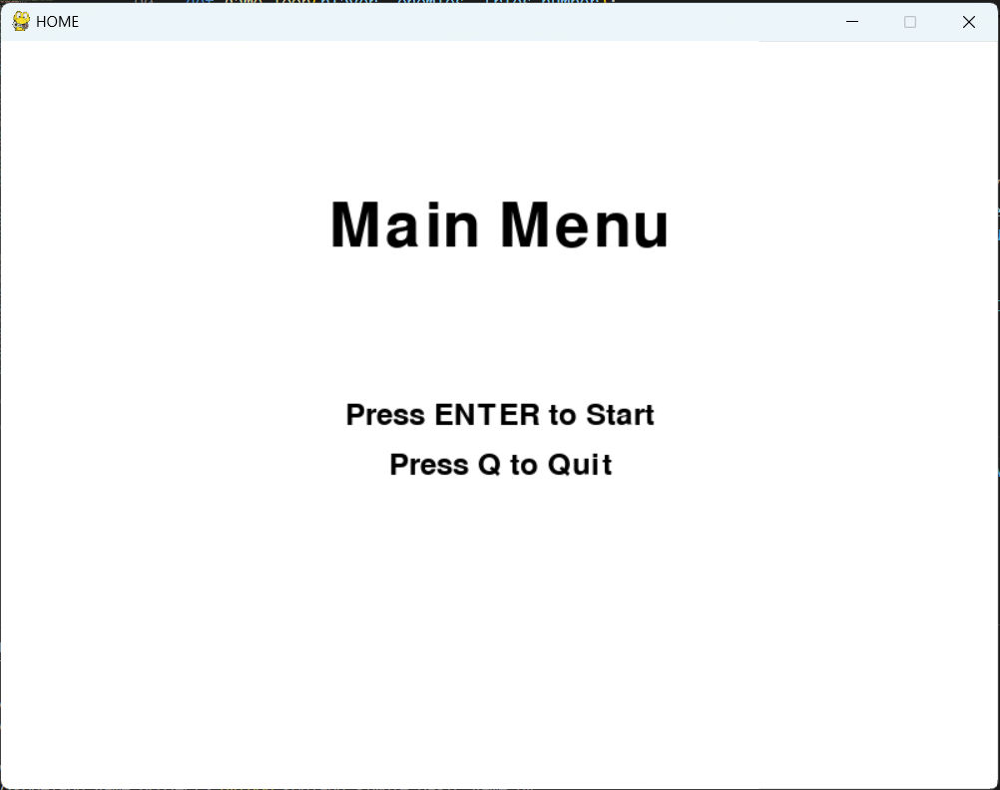
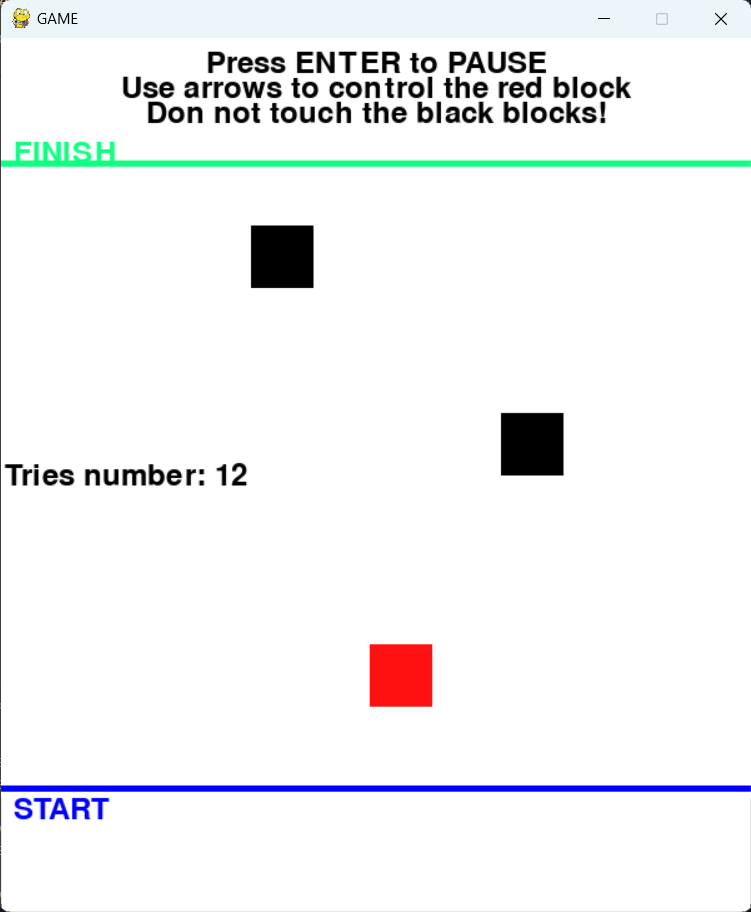
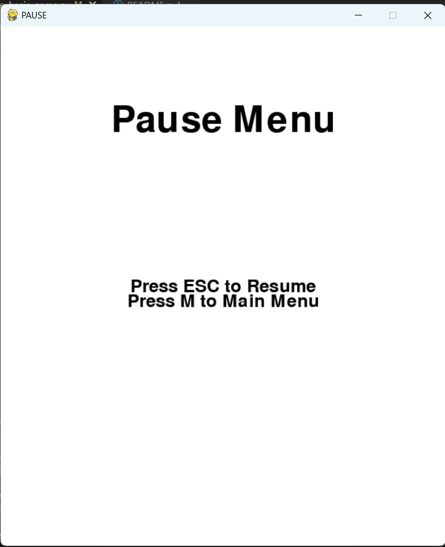

# kodeland game project

Minimum viable game

This repository is going to be filed up while the project is developed.

Below is the steps to install this little python game:

* Step 0.0 - Make sure to have installed the Python in you environment
It can be downloaded from the oficial web site [python org](https://www.python.org/downloads/) 

* * Step 0.1 - Make sure to have installed the pygame library on your envinroment. Perhaps, will be necessary to install it, so you can use: 
"pip install pygame library" command to install in your terminal
You can check the oficial web site from pygame: [pypi](https://pypi.org/project/pygame/)

* Step  1 - Clone the repository to your local environment from the link:
https://github.com/imtinti/kodeland_game_project

* Step 2 - Open your desired IDE (like vscode, for example) on the path that you have cloned the repository on the step 1

* Step 3 - In an terminal interface, execute this command:
python kodland_simple_basic_game.py

* Step 4 - If all steps were ok, you might be able to play and try to get the finishe line in the other screen field and win the game

# Game behaviour
Game objective: you are the red block and need to reach the other side of the screen without touching any other blak block! 

## Home screen
The user starts with a HOME SCREEN where is texted the user options:

After press to start the game, the user will reach the game screen

## Game screen

The user will find a screen like this:

## Pause menu

The user has the option to press the Enter key and go to the pause menu:

The user has the options to restart the game or go back to continue to play the current session.

If the user wants to quit the game, can just go back to main menu and presse quit, or to click on the window close button.

